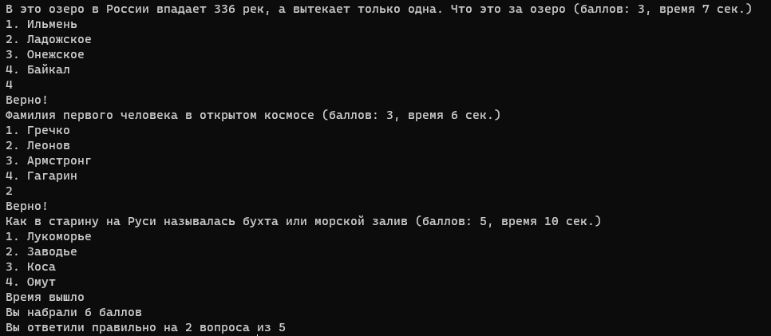

# Игра Викторина

Интелектульная игра "Викторина"

# Правила

- Нужно ответить на 5 вопросов
- У каждого вопроса есть своё время на ответ
- За правильный ответ даются баллы

# Скриншот



# Как запустить

```
git clone git@github.com:MarvinProg/Game_Quiz.git
cd Game_Quiz
ruby main.rb
```

# Добавление, изменение вопросов

Находятся вопросы в `data/questions.xml`

Вид отдельного вопроса:

```xml
<question seconds="XXX" points="XXX">
  <text>Вопрос</text>
  <variants>
    <variant>Ответ</variant>
    <variant>Ответ</variant>
    <variant right="true">Правильный ответ</variant>
    <variant>Ответ</variant>
  </variants>
</question>
```

# Версия Ruby

ruby 2.7.2
